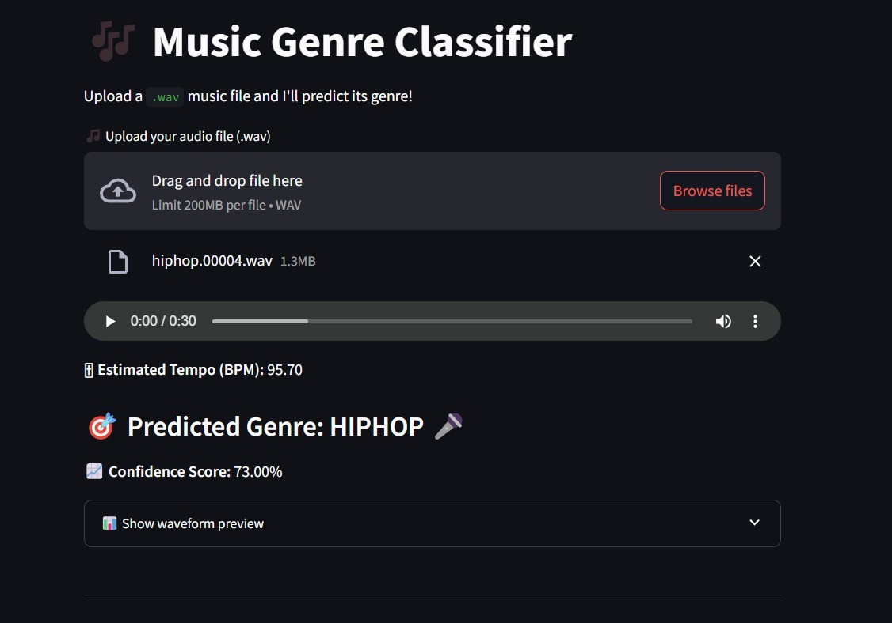

# 🎵 Music Genre Classifier

A sleek and simple Streamlit app that classifies the genre of a music clip using a machine learning model trained on audio features.

## 🚀 Features

- 🎧 Upload `.wav` audio files to predict genre
- 🌀 Smooth spinning loader while processing
- ⚡ Real-time predictions with a trained ML model
- 🧠 Built with Python, Streamlit, and Scikit-learn
- 📂 Organized, clean UI and responsive layout

## 📂 File Structure

```
music-genre-classifier/
├── app.py
├── genre_classifier.pkl
├── requirements.txt
├── README.md
└── assets/
    └── sample_audio/
```

## 🔧 Installation & Running

Make sure you have Python installed (preferably 3.8+).

```bash
# 1. Clone the repo
git clone https://github.com/your-username/music-genre-classifier.git
cd music-genre-classifier

# 2. Install dependencies
pip install -r requirements.txt

# 3. Run the Streamlit app
streamlit run app.py
```

## 🧠 How It Works

1. User uploads a `.wav` file.
2. The app extracts relevant audio features (MFCCs, etc.).
3. A trained classifier (e.g., RandomForest, SVM, etc.) predicts the genre.
4. Result is displayed in the UI, along with a loading spinner for user feedback.

## 📈 Model Info

- Trained on: [GTZAN Dataset] 
- Features: MFCCs extracted using Librosa
- Algorithm: [RandomForestClassifier] 
- 

## 📸 Screenshots




## 💡 Future Ideas

- Support for more audio formats (.mp3, .flac)
- Display waveform or spectrogram
- Genre probability chart

## 🧑‍💻 Author

Pull requests are welcome! If you have ideas, found bugs, or want to contribute in any way, feel free to open an issue or submit a pull request. 

You can also connect with me on [LinkedIn](https://www.linkedin.com/in/yogeshwaran-k-363800210/) to discuss or share feedback. 😊
